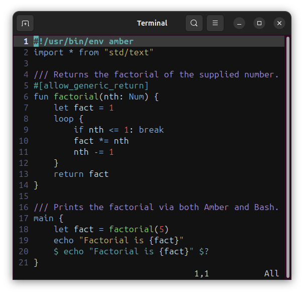

# Amber Vim Plugin

## Syntax Highlighting

The plugin applies syntax highlighting to the following Amber script elements:

* Shebang lines
* Inline and documentation comments
* Compiler flags
* Function names for definitions and calls
* Keywords and data types
* Numeric and boolean operators
* Numeric and boolean literals
* String literals with interpolation
* Bash commands with interpolation

## Editor Options

The plugin also sets these Vim options:

* Insert spaces not tabs; indent by four spaces
* Enable smart indentation, so we indent on line after "{"
* Continue inline or documentation comments on next line

## Plugin Installation

In Vim 8 and above:

    hwalters@Ghostwheel ~
    $ mkdir -p ~/.vim/pack/plugins/start
    hwalters@Ghostwheel ~
    $ cd ~/.vim/pack/plugins/start
    hwalters@Ghostwheel ~/.vim/pack/plugins/start
    $ git clone git@github.com:amber-lang/amber-vim.git
    Cloning into 'amber-vim'...
